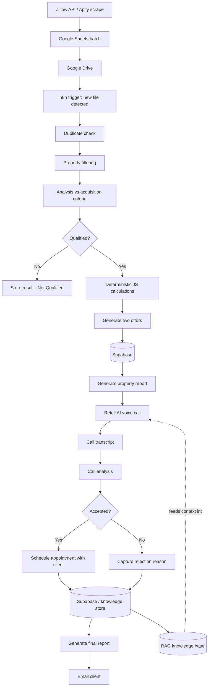

# AI Powered Real Estate Acquisition System, Architecture Reconstruction

> ⚠️ **Read [DISCLAIMER.md](./DISCLAIMER.md) first.** This is a sanitized, synthetic-data reconstruction of a real 2025 client engagement — not the original production code. See [docs/production-vs-reconstruction.md](./docs/production-vs-reconstruction.md) for exactly what's confirmed, inferred, or intentionally omitted.

## What this project is

In 2025, I designed and built an end-to-end AI automation pipeline for a U.S. real-estate acquisition client, targeting distressed homeowners struggling with mortgage payments. The system ran in production: it ingested property data, automatically qualified properties against the client's acquisition criteria, generated offers, placed real AI voice calls to homeowners, captured accept/reject outcomes, and handed accepted deals to the client for finalization — while continuously feeding call outcomes back into a knowledge base to improve future calls.

This was a paid, functioning production system, not a prototype or concept demo. After delivery, the client continued operating and extending it independently.

This repository is my public reconstruction of that architecture — built from memory, using synthetic data, after the original engagement ended and without retaining any client artifacts (per NDA).

## Why this project matters (skills demonstrated)

This wasn't "scrape Zillow and send an email." It was a multi-system agentic pipeline combining:

- **Workflow orchestration** across ingestion, qualification, calculation, calling, and reporting stages
- **Deterministic logic + LLM reasoning working together** — JavaScript for exact numbers, an LLM for analysis and document generation, so numeric output wasn't left to hallucination
- **Retrieval-Augmented Generation (RAG)** feeding real-time context to a live voice agent during calls
- **Voice AI (Retell AI)** conducting real outbound calls with a structured conversation flow and branching outcomes
- **Human-in-the-loop handoff** — the system qualified, contacted, and negotiated, but the client finalized deals himself
- **Persistent structured data** (Supabase) tying property, offer, qualification, and call data together
- **Feedback/knowledge loop** — transcripts and outcomes enriched the RAG knowledge base for future calls
- **Event-driven processing** — a new file landing in Google Drive kicked off the pipeline
- **Retry logic and duplicate prevention** for production reliability

## What the system did NOT do (no overselling)

- It did not autonomously "buy houses." Accepted opportunities were **handed to the client** to finalize.
- I do not claim specific business outcomes — deal counts, acceptance rates, revenue, or ROI are not stated anywhere in this repo because I don't have those numbers.
- I do not claim to have retained or to currently have access to the original production system.

## High-level architecture



See [docs/architecture-overview.md](./docs/architecture-overview.md) for a stage-by-stage explanation, and [docs/diagrams/](./docs/diagrams/) for the qualification and call-flow diagrams specifically.

## Repository structure

```
ai-real-estate-acquisition-system/
├── README.md                          ← you are here
├── DISCLAIMER.md                      ← NDA / synthetic-data notice — read first
├── docs/
│   ├── architecture-overview.md       ← stage-by-stage system explanation
│   ├── production-vs-reconstruction.md ← confirmed / inferred / unknown breakdown
│   └── diagrams/
│       ├── qualification-workflow.md
│       └── call-flow.md
├── data/synthetic/
│   ├── properties.json                ← fabricated Zillow-style property data
│   ├── homeowners.json                ← fabricated homeowner data
│   ├── call_transcript_example.md     ← fabricated call transcript
│   └── generated_report_example.md    ← fabricated report output
├── src/
│   ├── qualification/
│   │   └── example_qualification_logic.js
│   ├── offer_calculation/
│   │   └── example_offer_calculator.js
│   ├── rag/
│   │   └── example_rag_retrieval.md
│   ├── retell_call_flow/
│   │   └── example_call_flow.md
│   └── n8n_workflows/
│       └── example_workflow_representation.json
└── LICENSE
```

## Technology stack

| Layer | Tool |
|---|---|
| Orchestration | n8n (multiple discrete workflows) |
| Property data | Zillow API (later), Apify (initially) |
| Data staging | Google Sheets, Google Drive |
| AI reasoning / generation | OpenAI |
| Persistence + RAG backing store | Supabase |
| Voice AI | Retell AI |
| Deterministic calculations | JavaScript |
| Supporting integrations | Make.com (exact role not fully recalled — see disclaimer) |
| Reporting | Google Docs / PDF |
| Notifications | Email automation |

## About the reconstruction

Everything in `data/synthetic/` and `src/` is fabricated for demonstration. Where I no longer remember exact production details (formulas, schemas, criteria, prompts), the code is explicitly labeled as an illustrative placeholder rather than a re-creation of the original. Full detail in [docs/production-vs-reconstruction.md](./docs/production-vs-reconstruction.md).

## About me

I'm Ahmed Ounissi, finishing a B.S. in Software Engineering, focused on AI automation, agentic AI systems, and AI integration/implementation work. This project reflects real, paid client work building production agentic pipelines — not a tutorial exercise.
