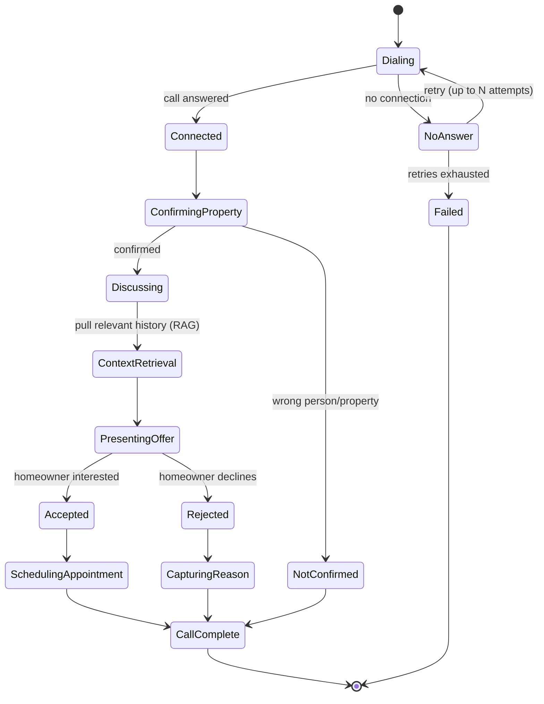

# Example Retell AI Call Flow (Illustrative State Machine)

> **Note:** This represents the confirmed *structure* of the call — the states and branches actually existed. The specific prompt wording, Retell agent configuration, and conversational tuning are not reconstructed here; the dialogue shown is synthetic (see `data/synthetic/call_transcript_example.md`).

## States



## Illustrative agent configuration shape (pseudo-config)

```yaml
# ILLUSTRATIVE ONLY — not the client's actual Retell agent configuration.
agent:
  name: "example-acquisition-agent"
  objectives:
    - confirm_property_and_homeowner
    - discuss_situation_empathetically
    - retrieve_relevant_context   # RAG lookup, see src/rag/
    - present_offer
    - capture_outcome
  retry_policy:
    max_attempts: 3          # synthetic value
    backoff: "illustrative"  # exact retry strategy not recalled
  outcomes:
    - accepted -> schedule_appointment
    - rejected -> capture_reason
    - not_confirmed -> end_call
  post_call:
    - generate_transcript
    - analyze_transcript
    - store_in_persistence_layer   # Supabase in production
    - ingest_into_rag_knowledge_base
```

## What's confirmed vs. illustrative here

| Element | Status |
|---|---|
| Call places outbound, confirms property, presents offer, branches on accept/reject | Confirmed |
| Retry logic exists for unanswered calls | Confirmed |
| Accepted → appointment scheduling with client | Confirmed |
| Rejected → reason captured | Confirmed |
| Post-call transcript feeds into RAG | Confirmed (loop), mechanism inferred |
| Specific retry count/backoff | Not recalled — synthetic placeholder |
| Exact Retell prompt/config | Not recalled — not reconstructed |
| Appointment scheduling tool | Not recalled — not reconstructed |
